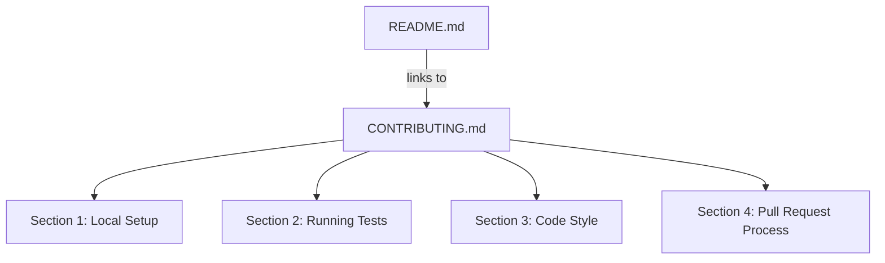

# Design Document: contributing-guide

## Overview

This feature adds a `CONTRIBUTING.md` file to the root of the StellarForge Rust workspace and updates `README.md` to replace its inline "Contributing" section with a link to the new file.

The change is purely documentary — no source code, build configuration, or CI pipeline is modified. The goal is to give contributors a single, authoritative reference for setup, testing, style, and the PR process, while keeping the README focused on project overview and contract details.

GitHub automatically surfaces a `CONTRIBUTING.md` at the repository root: it appears as a link in the "New issue" and "New pull request" flows, making it discoverable without any extra configuration.

## Architecture



Both files live at the repository root. No new directories are created. The README change is a surgical replacement of the existing "Contributing" section with a single-sentence link.

## Components and Interfaces

### CONTRIBUTING.md

A standalone Markdown file at `./CONTRIBUTING.md`. It is self-contained — a reader needs no other document to complete the contribution workflow.

Sections (in order):

1. **Prerequisites & Local Setup** — required tools, minimum versions, install commands, clone + build command.
2. **Running Tests** — workspace-wide and per-contract test commands, all five package names listed explicitly.
3. **Code Style** — `cargo fmt`, `cargo clippy`, doc comment requirement, no-`unsafe` rule, no-external-crates rule.
4. **Pull Request Process** — fork/branch/PR workflow, description requirements, CI gate, approval requirement, test coverage requirement for new contracts/APIs, commit hygiene.

### README.md (modification)

The existing inline "Contributing" section:

```markdown
## Contributing

PRs welcome. Please ensure:
- `cargo fmt --all` passes
- `cargo clippy --all-targets -- -D warnings` passes
- `cargo test --workspace` passes
- New functions have `///` doc comments
```

is replaced with:

```markdown
## Contributing

See [CONTRIBUTING.md](CONTRIBUTING.md) for setup instructions, code style requirements, and the pull request process.
```

## Data Models

This feature involves no code data models. The artifacts are two Markdown files:

| File | Location | Action |
|---|---|---|
| `CONTRIBUTING.md` | Repository root | Create (new file) |
| `README.md` | Repository root | Modify (replace Contributing section) |

Both files are static text with no structured data schema beyond Markdown formatting conventions.

## Correctness Properties

*A property is a characteristic or behavior that should hold true across all valid executions of a system — essentially, a formal statement about what the system should do. Properties serve as the bridge between human-readable specifications and machine-verifiable correctness guarantees.*

Most acceptance criteria for this feature are concrete content checks on static files (examples), not universal properties over a range of inputs. The one genuine property is over the fixed set of contract package names.

### Property 1: All contract package names are documented

*For any* package name in the set `{forge-governor, forge-multisig, forge-oracle, forge-stream, forge-vesting}`, that name SHALL appear in `CONTRIBUTING.md` as a valid value for the `-p` flag.

**Validates: Requirements 2.3**

## Error Handling

This feature introduces no executable code, so there are no runtime errors to handle. The relevant failure modes are authoring errors caught at review time:

| Failure | Detection | Resolution |
|---|---|---|
| A package name is missing from the `-p` examples | Property test / PR review | Add the missing name |
| A command in CONTRIBUTING.md is wrong or outdated | Manual verification / CI | Correct the command |
| README still contains the old inline Contributing section | Example test / PR review | Remove the old section |
| CONTRIBUTING.md is not at the repository root | Example test / PR review | Move the file |

## Testing Strategy

Because this feature produces only Markdown files, the testing strategy is lightweight but still automated.

### Unit / Example Tests

Each of the following is a single assertion on file content. They are grouped into two test functions:

**`test_contributing_md_content`** — asserts that `CONTRIBUTING.md`:
- exists at the repository root
- contains `wasm32v1-none`, `stellar-cli`, `v25.2.0`
- contains `rustup target add wasm32v1-none`
- contains `cargo install --locked stellar-cli`
- contains `cargo build --workspace`
- contains `cargo test --workspace`
- contains `cargo test -p`
- contains language indicating tests must pass before submitting a PR
- contains `cargo fmt --all`
- contains `cargo clippy --all-targets -- -D warnings`
- contains `///` (doc comment notation)
- contains a statement about no `unsafe` code
- contains a statement about no external crates beyond `soroban-sdk`
- contains fork/branch/PR workflow description
- contains language about PR descriptions summarising changes
- contains language about CI checks passing before review
- contains language about maintainer approval
- contains language about test coverage for new contracts/APIs
- contains language about commit hygiene (squash / atomic)

**`test_readme_contributing_section`** — asserts that `README.md`:
- contains a Markdown link to `CONTRIBUTING.md`
- does NOT contain the old inline bullet list (`cargo fmt --all` inside the Contributing section without a surrounding link)

### Property-Based Tests

Use a property-based testing library appropriate to the implementation language (e.g., `proptest` for Rust, `hypothesis` for Python, `fast-check` for TypeScript).

**Property Test 1: All package names present**

```
// Feature: contributing-guide, Property 1: All contract package names are documented
for each name in ["forge-governor", "forge-multisig", "forge-oracle", "forge-stream", "forge-vesting"]:
    assert contributing_md_content.contains(name)
```

Minimum iterations: 5 (the set is fixed and exhaustive, so all five must be checked).

Each correctness property MUST be implemented by a single property-based test referencing the design property by tag.

### Dual Testing Rationale

- Example tests catch concrete missing content and verify the README replacement.
- The property test ensures no package name is accidentally omitted when the file is edited in the future.
- Together they provide full coverage of all acceptance criteria.
